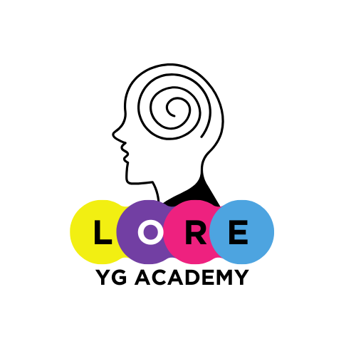
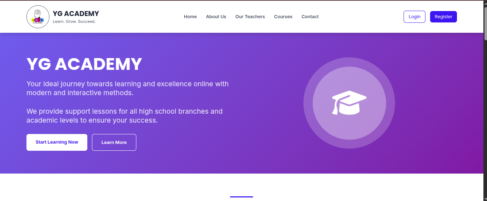

# 🎓 YG Academy

[](https://djangoproject.com/)
[](https://python.org/)

> A modern Django-based academy management system - A side project to master Django development and integrate cutting-edge AI features.



## 🚀 Project Overview

YG Academy is a comprehensive educational management platform built with Django. This project serves as both a learning journey into Django's ecosystem and a testing ground for implementing innovative features in educational technology.

## 📸 Screenshots

### Dashboard Overview


### Student Management Interface


### Course Management System


## 🏢 Current Features & Functionality

### 🔐 Authentication System
- **User Registration** - Custom user registration with email validation
- **User Login/Logout** - Secure authentication system
- **Password Reset** - Email-based password recovery
- **Role-Based Access** - Separate student and teacher accounts

### 👨‍🏫 Teacher Features
- **Teacher Dashboard** - Dedicated teacher interface
- **Student Management** - View and manage student accounts
- **Subject Access Control** - Grant/revoke student access to subjects
- **Math Video Management** - Add, organize, and delete math course videos
- **Course Organization** - Structure videos by course and chapter

### 👨‍🎓 Student Features
- **Student Dashboard** - Personalized student interface
- **Subject Access** - Access to Math, Physics, Science, History, and English (based on permissions)
- **Video Learning** - Watch educational videos with organized course structure
- **Subject-Specific Content** - Dedicated pages for each subject area

### 📚 Course Management
- **Math Courses** - Complete math course system with video organization
- **Chapter Organization** - Videos organized by course and chapter
- **Video Player** - Integrated video watching experience
- **Course Ordering** - Sequential organization of course content

### 🔒 Permission System
- **Subject-Based Access** - Granular control over subject access
- **Teacher-Only Areas** - Protected teacher functionality
- **Access Control Decorators** - Secure page access based on user roles
- **Subject Unavailable Pages** - Proper handling of access restrictions

### 🌐 Website Navigation
- **Home Page** - Main landing page
- **About Page** - Information about the academy
- **Teachers Page** - Teacher information
- **Contact Page** - Contact information
- **Content Page** - General content area

## 🛠️ Technology Stack


- **Backend**: Django 4.x, Python 3.x
- **Database**: SQLite (development), PostgreSQL (production ready)
- **Frontend**: HTML5, CSS3, JavaScript, Bootstrap
- **Authentication**: Django's built-in authentication system
- **User Management**: Custom User model with role-based permissions

## 📦 Installation & Setup

### Prerequisites
- Python 3.8+
- pip
- virtualenv (recommended)

### Quick Start
```bash
# Clone the repository
git clone https://github.com/GhilaniYassine/YG_Academy.git
cd YG_Academy

# Create virtual environment
python -m venv venv
source venv/bin/activate  # On Windows: venv\Scripts\activate

# Install dependencies
pip install -r requirements.txt

# Run migrations
python manage.py migrate

# Create superuser
python manage.py createsuperuser

# Start development server
python manage.py runserver
```

## 📁 Project Structure

```
YG_Academy/
├── app/                    # Main application directory
│   ├── views.py           # Application views and logic
│   ├── models.py          # Database models (CustomUser, MathCourse)
│   └── urls.py            # URL routing
├── static/                 # Static files (CSS, JS, images)
├── templates/              # HTML templates
├── media/                  # User uploaded files
├── img/                    # Documentation images
├── requirements.txt        # Python dependencies
├── manage.py              # Django management script
└── README.md              # Project documentation
```

## 🎯 Implemented Features

### ✅ Completed Features
- [x] User authentication (login/logout/register)
- [x] Role-based access control (teachers vs students)
- [x] Teacher dashboard with student management
- [x] Subject-based permission system
- [x] Math course video management
- [x] Video organization by course and chapter
- [x] Student video watching interface
- [x] Password reset functionality
- [x] Custom user model with subject permissions
- [x] Protected views with decorators
- [x] Error handling (404, access denied)


## 🤝 Contributing

This is a learning project, but contributions and suggestions are welcome! Feel free to:
- Report bugs
- Suggest new features
- Submit pull requests
- Share educational insights

## 📝 License

This project is licensed under the MIT License - see the [LICENSE](LICENSE) file for details.

## 🎓 Learning Journey

This project represents my journey in mastering Django development while exploring educational technology. Each commit brings new knowledge and better coding practices.

## 🎨 UI/UX Preview

### Login Interface


⭐ **Star this repository if you find it helpful!**

**Made with ❤️ and lots of ☕ by [Yassine Ghilani]**
#YG
